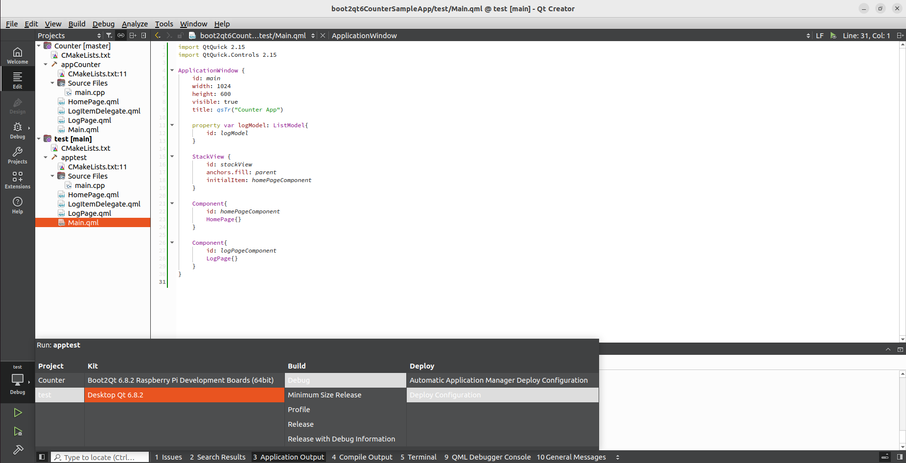
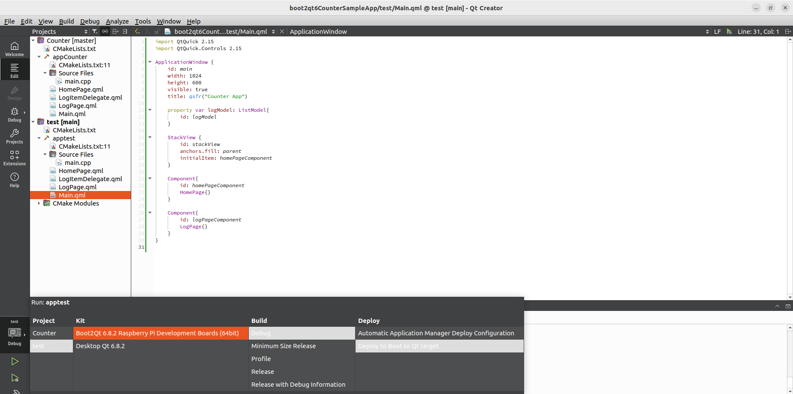
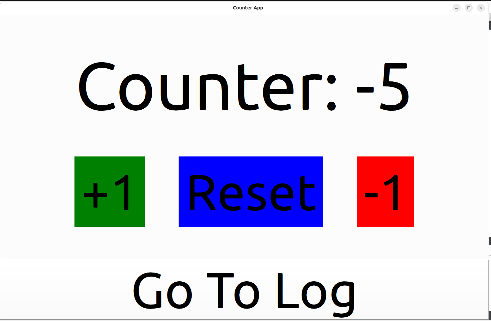
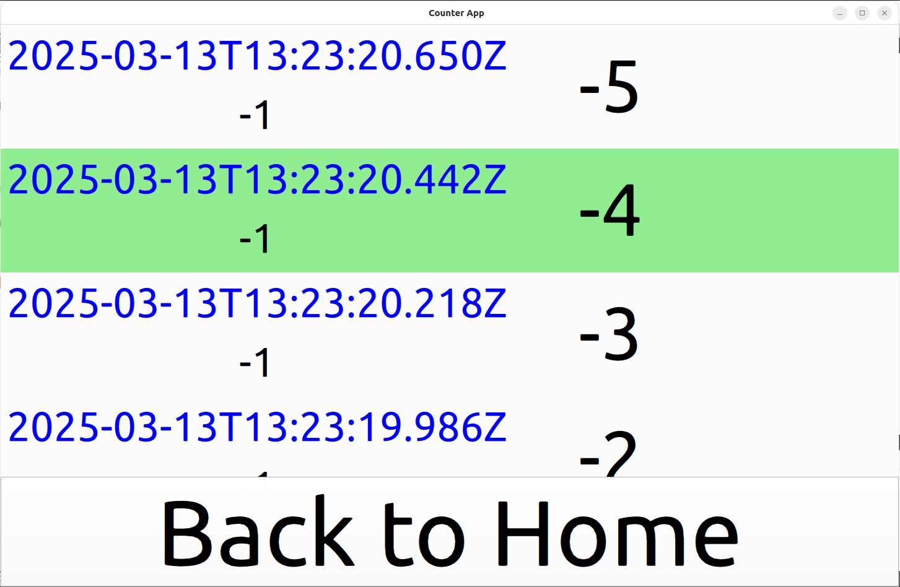
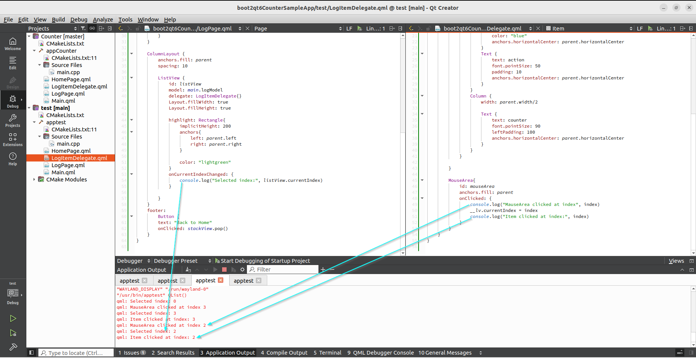

# Boot2Qt6 Counter Sample Application

This repository accompanies the blog post ["Quick Start with Boot2Qt6 on Raspberry Pi"](https://vvidov.gitlab.io/blog/quick-start-boot2qt6-raspberry-pi), demonstrating how to set up a complete Qt6 development environment in Ubuntu VM for Raspberry Pi deployment.

## Development Setup

### Desktop Build Configuration

Local development setup in Qt Creator:
- Ubuntu VM development environment
- Desktop kit for rapid testing
- Full debugging capabilities

### Raspberry Pi Configuration

Remote device setup in Qt Creator:
- Boot2Qt cross-compilation toolchain
- Remote debugging configuration
- Device deployment settings

## Application Interface

### Counter Screen

Main application interface:
- Counter with increment/decrement
- Reset button (active when counter ≠ 0)
- Event logging on each action

### Log View

Interactive log viewer:
- Custom-styled entries
- Selection highlighting
- Timestamp and value tracking

## Device Debugging Example

### Real-time Log Selection Debugging

Practical debugging on Raspberry Pi:
- Console output before selection
- CurrentIndex change monitoring
- Post-selection state logging
- Complete debugging cycle example

This example demonstrates:
- Remote debugging setup
- Strategic log placement
- State tracking techniques
- Real device debugging workflow

## Blog Post Reference

For detailed instructions on setting up the development environment and creating this application, visit our blog post:
"Quick Start with Boot2Qt6 on Raspberry Pi" at https://vvidov.gitlab.io/blog/quick-start-boot2qt6-raspberry-pi

## License
MIT License
